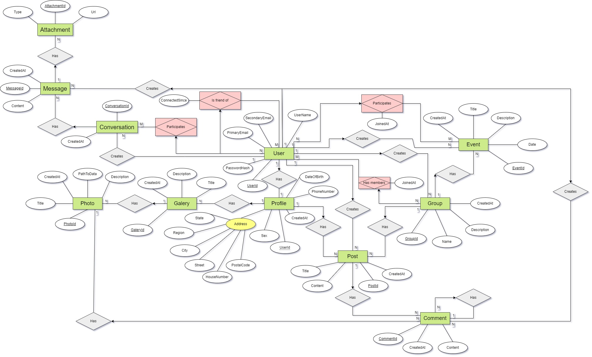
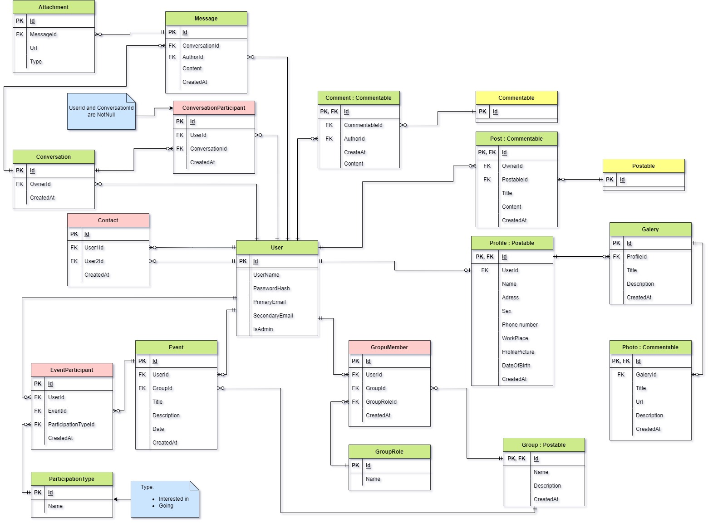

# Social network
A semestral project for PV179 course at FI MUNI.

## USE CASES
- USER & ADMIN & GROUP CEO 
- - authentication
- - role
- profile (user/admin public information)
- - CRUD
- - friends management
- - adding post to profiles
- - controlling visibility of profile status (private/friends only/public)
- gallery (banch of photos)
- - CRUD
- - uploading pictures to profile-gallery
- - adding comments to photos
- post (only text)
- - CRUD (by owner/D by admin)
- - adding comments to posts
- sending personal messages to other users
- groups
- - CRUD 
- - group posts
- events
- - CRUD 
- - sign up for a event
- user search/filter (diff parameters such as name/age/sex/common friends)
- private chat
- group chats

## Conceptual ERD diagram

## Physical ERD diagram

## Team members (UCO, name, email):
- 484946, Michal Cizek, -
- 485522, Daniel Pivonka, -
- 469107, Matej Turek, 469107@mail.muni.cz
